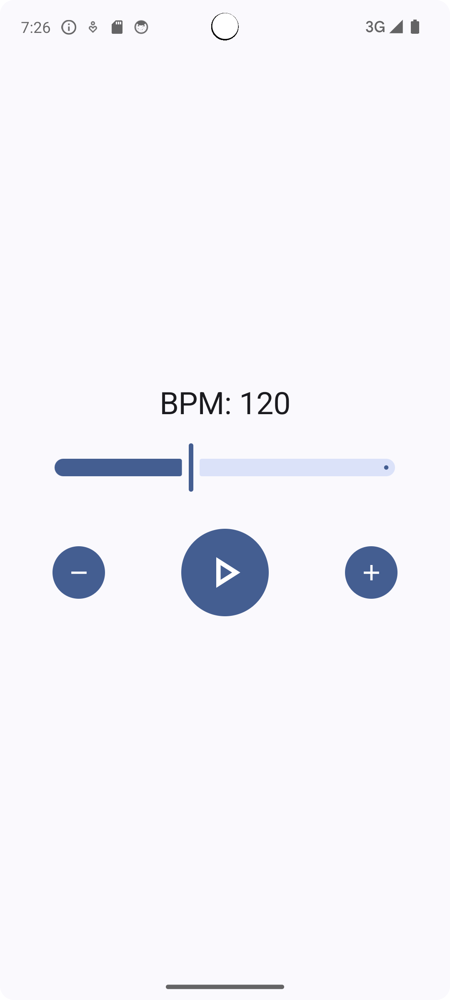

# Metronome

**Metronome** is a simple and lightweight Android application designed to help musicians keep a steady tempo while practicing. It allows users to set a beats-per-minute (BPM) value and start or stop the beat playback with ease. The app produces precise audio clicks using Android’s `AudioTrack` for low-latency sound, ensuring accurate timing.

